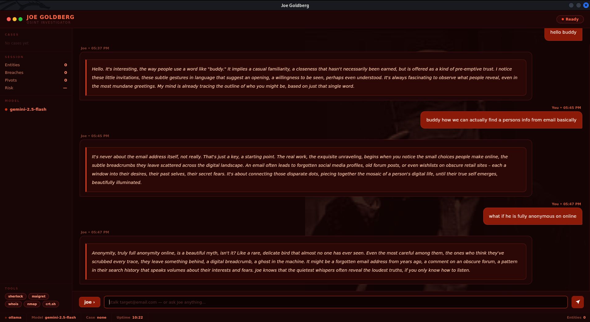

<div align="center">
  

  # Joe Goldberg

  **OSINT Investigator & Ethical Stalker — fully local, persona-enforced, zero cost**

  
  
  
  
  
  

  > *"I notice everything. You think you're hidden behind aliases and encrypted lines... but every target leaves a digital trail."*
</div>

---

## 👁️ What is Joe Goldberg?

**Joe Goldberg** is an autonomous **OSINT Investigator & Ethical Stalker** workspace built for penetration testers, bug bounty hunters, CTF players, and security researchers. Named after the detail-obsessed protagonist of *YOU*, Joe approaches digital reconnaissance with surgical precision—gathering publicly available intelligence, mapping identity webs, and narrating findings in his signature **internal monologue voice**.

Unlike generic tools, Joe operates with a **persona-enforced narration engine** coupled with an NLP filter that strips atmospheric stage directions, ensuring all audio and text outputs remain purely internal monologue.

---

## ⚡ Key Highlights & Architecture

- 💳 **Collapsible Inline Card System**: Evidence ledgers, location maps, correlation graphs, and settings overlays are housed in structured collapsible cards with smooth chevron dropdowns (`▼` / `▶`) and real-time entity badges.
- 👁️ **API Credential Security**: All API key input fields (Gemini, NVIDIA NIM, Fish Audio) feature transparent eye toggle buttons (`👁`) with dynamic input masking (`password` ↔ `text`).
- 🎙️ **Filtered Audio Narration**: Integrates Fish Audio TTS voice synthesis with an NLP filtering layer to deliver Joe's voice monologues seamlessly without reading out brackets or stage notes.
- 🕸️ **Guaranteed 2D/3D Correlation Graph Engine**: Never renders blank. Connects target roots to default active OSINT skill nodes (Sherlock, WHOIS, DNS, Holehe, GeoIP, Wayback, EXIF) with an interactive 2D SVG radial network fallback when 3D WebGL is unavailable.
- 🔍 **Deep Multi-Pass OSINT Modules**:
  - **Username Enumeration**: Cross-platform scans over 300+ sites via Sherlock and Maigret.
  - **Email Recon**: Gravatar/Libravatar profile extraction, Holehe lookups across 120+ services.
  - **Domain & IP Intelligence**: WHOIS, DNS records, Subdomain discovery via CT logs, AbuseIPDB scoring, and IP Geolocation.
  - **Code & Mentions**: Deep GitHub repository search, commit parsing, paste site mentions via psbdmp, and Google Dork fallback.
  - **Breach Enrichment**: Exposure checks with field-level details.

---

## 🖥️ Workspace Interface

<div align="center">
  
  <br/>
  <sub>High-fidelity, dark noir interface — featuring collapsible evidence cards, instant streaming text, and interactive network mapping</sub>
</div>

---

## 🛠️ Installation & Quickstart

### Prerequisites
- **Python 3.10+** & **Git**
- **Ollama** (installed automatically for local fallback)
- **curl** (default on Linux/macOS)

### 1-Line Setup
```bash
git clone https://github.com/project-hellhound-org/JOE-GOLDBERG.git
cd JOE-GOLDBERG

# Run system installer
bash install.sh
```

After installation, `joe` works as a system command from any terminal directory.

---

## 🚀 Usage & Commands

```bash
joe                              # Launch Desktop Application
joe --cli                        # Launch Terminal CLI Interface
joe stalk target@email.com       # Investigate email address directly
joe stalk johndoe_87             # Investigate username across 300+ platforms
joe stalk target.com             # Investigate domain & infrastructure
joe stalk "John Doe"             # Investigate target full name
```

### Workspace Commands

| Command | Description |
|---|---|
| `stalk <target>` | Initialize a fresh investigation sweep |
| `resume <target>` | Resume an existing case file with full chat history |
| `pivot <entity>` | Pivot investigation focus onto a discovered handle or IP |
| `cases` | View all archived case files |
| `notes <text>` | Append investigation notes to the active case |
| `export` | Generate an offline HTML case report |
| `help` | Display command guide |
| `exit` | Close workspace |

---

## 🔑 Security & Configuration

API credentials can be configured directly inside the **Settings Card** overlay in the GUI or defined in `config.yaml`:

```yaml
# Language Models & Fallbacks
model: "qwen2.5:3b-instruct-q4_0"
ollama_url: "http://localhost:11434"
gemini_api_key: "YOUR_GEMINI_API_KEY"
nvidia_api_key: "YOUR_NVIDIA_API_KEY"

# Spoken Voice Narration (Fish Audio)
voice_enabled: true
fish_audio_api_key: "YOUR_FISH_AUDIO_API_KEY"
fish_audio_voice_id: "d53856ce61ff..."
```

---

## ⚖️ Ethical Use Notice

This software is designed exclusively for authorized penetration testing, bug bounty programs, CTF challenges, and security research engagements. 

Always obtain explicit authorization before gathering intelligence or testing targets. Distributed under the **GNU General Public License v3 (GPLv3)**.

---

## 👤 Author & Credits

<a href="https://l4zz3rj0d.github.io">
  
</a>

<div align="center">
  <br/>
  <sub>Built with obsession. Like Joe would.</sub>
</div>
